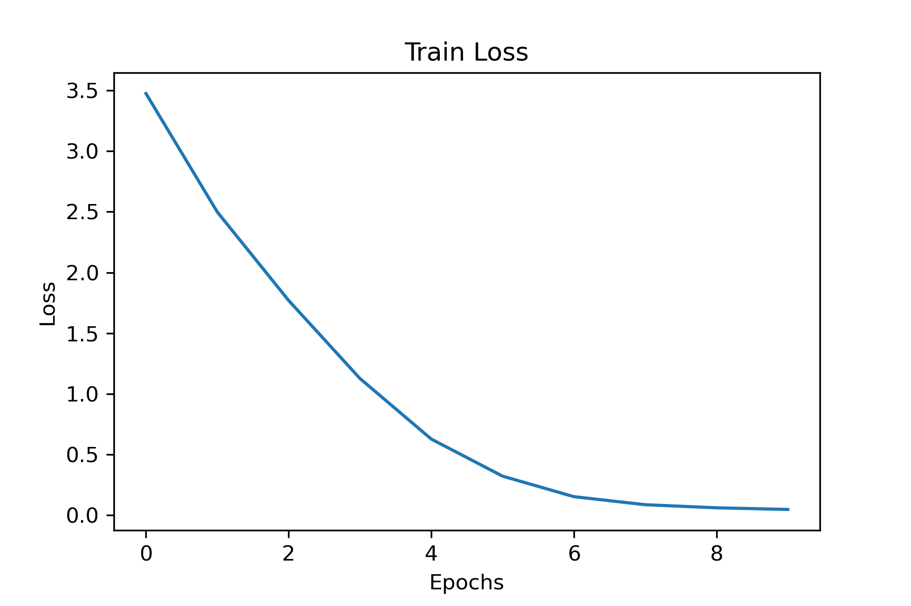
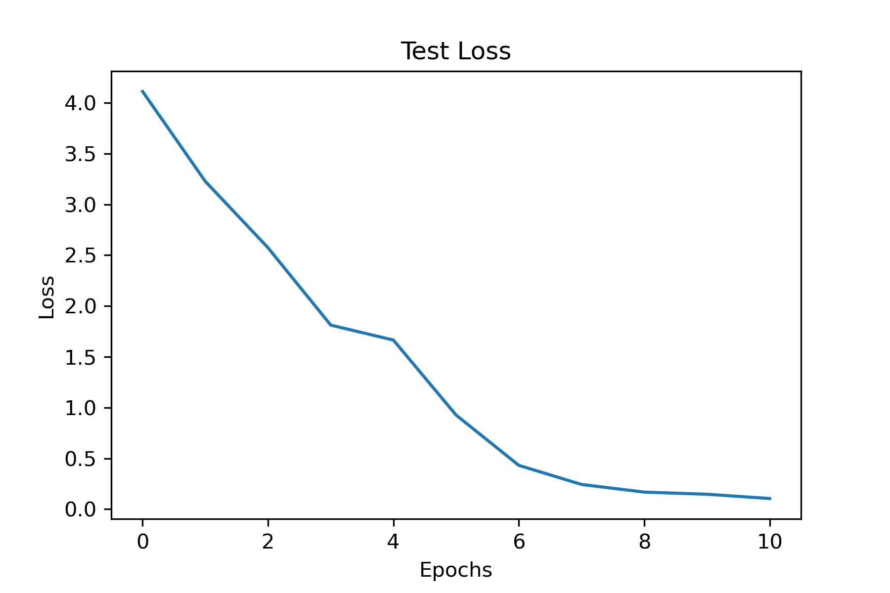
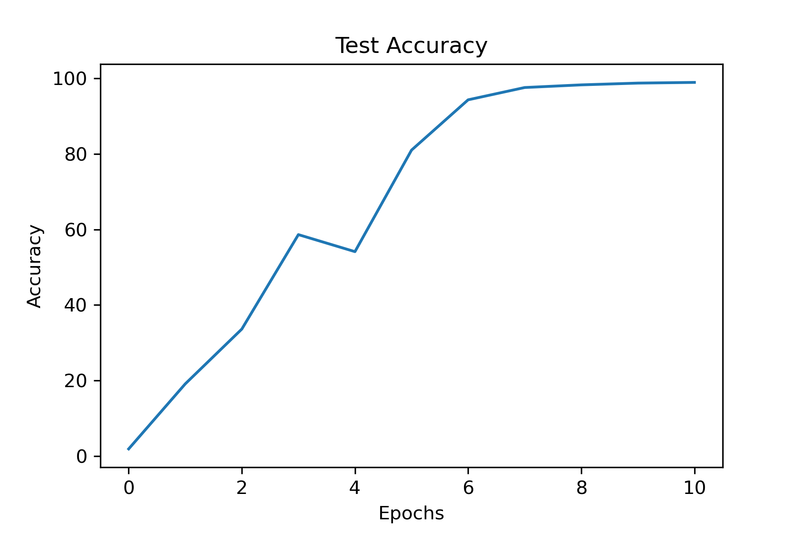

# CSE 490g Final Project
Aric Prieve

This is my final project for [CSE 490g Autumn 2022](https://courses.cs.washington.edu/courses/cse490g1/22au/) at the University of Washington. The code for this project is [here](https://github.com/arprieve/deep-learning-final-project). 

## Abstract 

My goal for this project was to train a classifier to predict which national park an image was taken from. As data is at the core for successful deep learning I wanted to experiment both with training a convolutional network on new data and collecting that data to see the effects of a new type of dataset. I wanted to learn how difficult gather and assembling a dataset for computer vision was and if this type of data collection could yield something interesting/meaingful. In this project I did just that on the [national parks](https://en.wikipedia.org/wiki/List_of_national_parks_of_the_United_States) in the US. I learned a lot about data collection and thought I had some decent results in the end.

## Problem statement

I will create a datset of images of each of the National Parks in the US with about 350 samples each. These images will be scraped from the internet and will need to be standarized. This standardization includes normalization and sizing (256x256 images were used). I then will train a convolutional neural network of a few different types to compare performance both of the models on the dataset and whether this dataset needs improvement.

## Related work

## Methodology

The first portion of this project was gathering the data. The code for this step in `get_images.ipynb`. I first downloaded a csv of the national parks to serve as the labels for the dataset. Next was gathering the images. I chose to download 500 images of each national park using web scraping on google images with the search query `"[national park] National Park Landscape"`. Initally I found this difficult as much of the APIs in python for this type of task were depracted. I then found a perfectly functioning API for this task, but would use Bing as the search engine. I chose to use this which  worked well until the realization that Bing is not a good search engine. Many of the downloaded pictures would not actually refer to search query and would show Yosemite (probably a popular national park) as the image. I then reran this task using `simple_image_download` which was less reliable in terms of downloads (would download a number of images from 320 - 400), but resulted in much higher quality images that actually matched the query.

The downloaded images still needed to be in a standard size. Most images were much higher resoltion than needed (or desired) and not a consistent aspect ratio so I downsized them, also in python, to 256x256 images. Now with around 350 images for each national park I was ready to use them for training a neural network.

I then created another python notebook similar to homework 1 from this quarter. I created a custom torch dataset where I normalized the images, batched, and labeled the images similar to homework 2. I started by defining my model similar to my result from homework 1 which was trained on TinyImageNet but adjusted and tinkered with different model architecture and hyperparameters. Finally I plotted my results across those changes and showed the weaknesses of the model (or the dataset) with a confusion matrix.

## Experiments/evaluation

## Results

## Video

Here is my video...
